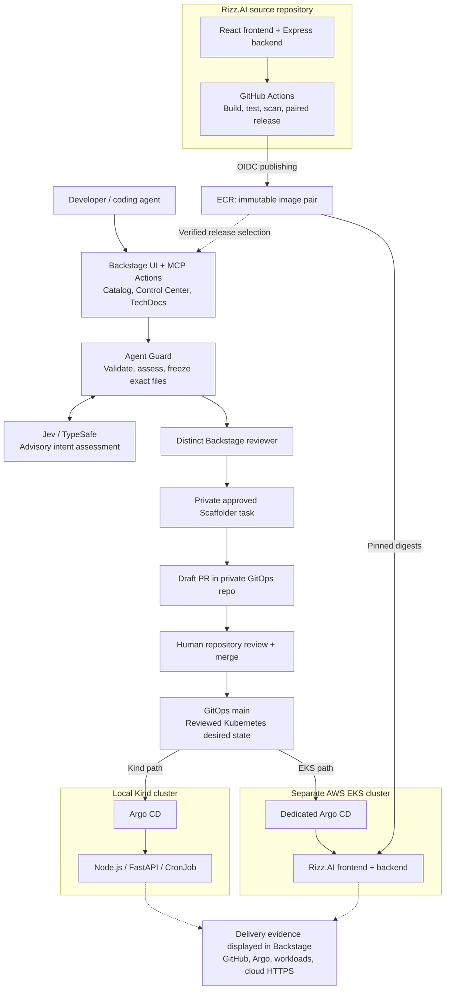
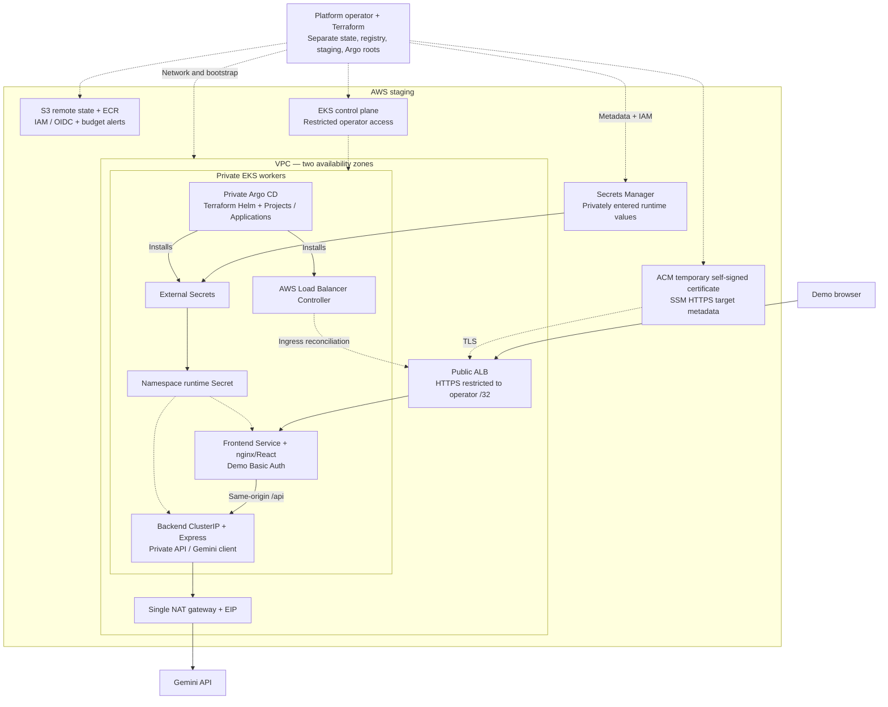

# Backstage Agent Guard

**An internal developer platform for agent-assisted, human-reviewed GitOps delivery.**

Developers and coding agents propose application changes through Backstage. Agent Guard validates the scope, compares the change with the declared intent using **Jev**, and freezes the exact files for review. A different authorized person approves the proposal; Backstage opens a GitOps pull request; a human merges it; Argo CD reconciles the cluster.

The project combines platform engineering, semantic intent assessment, Kubernetes delivery, and infrastructure as code in one portal. It supports two independent paths:

- **Local golden paths:** create an internal Node.js API, FastAPI service, or scheduled worker from platform-owned templates and deploy to Kind.
- **Rizz.AI lifecycle:** release a verified React/nginx frontend and Express/Gemini backend pair to EKS staging, propose bounded replica changes, roll back to a verified deployment, or retire the application in reviewed stages.

## Architecture

Backstage runs locally in the demonstrated setup. Kind and AWS EKS are separate delivery targets; enabling a portal profile does not provision either target. The first diagram shows the delivery workflow; the second shows the AWS infrastructure. Dotted arrows indicate configuration or read-only observation.



### Cloud infrastructure



Terraform owns the foundation and Argo bootstrap. Argo owns the application manifests and installs the platform controllers from Terraform-registered Applications. External Secrets owns runtime secret synchronization; the Load Balancer Controller owns ALB reconciliation. The diagram describes the configured architecture, not an assertion that AWS resources are currently running.

### How a change reaches the cluster

1. **Propose:** submit a bounded request in Backstage or through its MCP Actions. Kind uses trusted templates; EKS releases select a verified frontend/backend pair.
2. **Assess:** validate identity, target, and inputs; ask Jev whether the proposed change matches the declared intent. Uncertain or conflicting results hold the proposal for clarification.
3. **Freeze and review:** render exact files and bind their hashes, inputs, target, and policy to the approval digest. A different eligible Backstage user reviews that snapshot.
4. **Publish:** the private Scaffolder action revalidates approval and opens a draft GitOps PR. Changing the snapshot requires a fresh review.
5. **Merge and reconcile:** human repository review and merge trigger Argo CD reconciliation. Backstage approval and GitOps merge are separate decisions.
6. **Observe:** check the merged files, Argo revision, workload images/readiness, and cloud HTTPS evidence. A PR or an Argo badge alone does not prove a successful rollout.

Application code changes follow **source CI → verified image pair → Backstage proposal → review → GitOps merge → Argo CD**. Routine releases and replica changes do not run Terraform; changes to EKS capacity or the AWS foundation use a separate infrastructure workflow.

## Features

| Capability                            | What this project implements                                                                                                                                                                      |
| ------------------------------------- | ------------------------------------------------------------------------------------------------------------------------------------------------------------------------------------------------- |
| **Platform engineering golden paths** | Three bounded service templates with consistent ownership, internal exposure, and reviewed GitOps delivery.                                                                                       |
| **Jev semantic assessment**           | Choice classification, Noul intent-preservation probability, and a Score for mismatch severity. These inform review; deterministic policy and a human decision control execution.                 |
| **Agent integration through MCP**     | Official Backstage MCP Actions expose proposal and status tools. The agent cannot self-approve or directly execute protected Scaffolder, Kubernetes, or Terraform operations through these tools. |
| **Approval integrity**                | Frozen file previews, SHA-256 approval bindings, distinct reviewer checks, execution revalidation, and persisted proposal/audit history.                                                          |
| **Verified paired releases**          | Backstage checks publishing evidence and ECR digests before offering a frontend/backend pair, avoiding arbitrary user-supplied images.                                                            |
| **Application lifecycle**             | Reviewed release, bounded replica change, rollback to a verified deployment, and staged retirement proposals for Rizz.AI.                                                                         |
| **Developer portal and ownership**    | A shared request overview, application Control Center, Catalog ownership, Kubernetes views, release browsing, and TechDocs.                                                                       |
| **Operational evidence**              | Read-only GitHub, Argo, Kubernetes, and HTTPS observations; scoped workload events/logs and bounded backend metrics when the target is reachable.                                                 |
| **Infrastructure as code**            | Separate Terraform roots for state, registry, EKS, Argo installation, and GitOps bootstrap. A separate reviewed-plan runner contract exists but is disabled by default.                           |
| **CI checks without AWS authority**   | TypeScript/backend contract checks, mocked Terraform tests, configuration profile tests, and pinned controller chart input checks.                                                                |

**Stack:** Backstage · TypeScript/React · Jev/TypeSafe · MCP · GitHub Actions · Argo CD · Kubernetes/Kind · Terraform · AWS EKS/ECR/S3/IAM/ALB/Secrets Manager · External Secrets · Helm.

## Try it locally

### 1. Start the portal without AWS

Requirements: Git and **Node.js 22 or 24**. Docker is needed only for on-demand TechDocs generation and the optional Kind demo; Kind and kubectl are needed for local cluster delivery. Native dependency installation may require Python and a C/C++ build toolchain.

```sh
git clone https://github.com/YASHMAHAKAL/backstage-agent-guard.git
cd backstage-agent-guard
node .yarn/releases/yarn-4.13.0.cjs install --immutable
node --env-file-if-exists=.env .yarn/releases/yarn-4.13.0.cjs start
```

Open **<http://localhost:3000>**. Explore the Catalog, TechDocs, and **Agent Guard → New Kind request**. The guest profile can submit a proposal, but its shared identity cannot complete distinct human review. A real Jev assessment requires `TYPESAFE_API_KEY` in an ignored `.env` file; an unavailable assessment does not become approval. AWS credentials are unnecessary for this path.

### 2. Enable two-person GitHub review

Create a GitHub OAuth application for the local portal: homepage `http://localhost:3000`, callback `http://localhost:7007/api/auth/github/handler/frame`. These follow [Backstage's GitHub provider setup](https://backstage.io/docs/auth/github/provider/).

Add the following to the ignored `.env` file, using your private values:

```dotenv
AUTH_GITHUB_CLIENT_ID=your-client-id
AUTH_GITHUB_CLIENT_SECRET=your-client-secret
TYPESAFE_API_KEY=your-typesafe-key
```

Copy the user mapping example and set the two accounts' immutable GitHub node IDs and eligible group memberships:

```sh
cp examples/github-users.example.yaml examples/github-users.yaml
chmod 600 .env examples/github-users.yaml
node .yarn/releases/yarn-4.13.0.cjs start:github
```

Use separate browser sessions for requester and reviewer. The example places both users in `payments-team` for the Kind demo; Rizz.AI routine review uses `rizz-team` or `platform-team`, while retirement and infrastructure review require platform authority. Catalog visibility does not itself grant review permission.

### 3. Connect local GitOps delivery

Follow the [Kind bootstrap guide](deploy/README.md) to create the dedicated cluster, install Argo CD, connect **your** GitOps repository with read-only credentials, and configure the staging Application. Set the private GitOps publishing connection in an ignored `.env.delivery.local` file:

```dotenv
GITHUB_TOKEN=your-gitops-publishing-token
AGENT_GUARD_GITOPS_REPO_URL=github.com?owner=YOUR_OWNER&repo=backstage-agent-guard-gitops
```

Create or fork the GitOps repository under your owner with the name `backstage-agent-guard-gitops`; the local publisher currently enforces that repository name. Adapt the repository references in the Kind Application to your fork. Give the publishing credential the repository contents/pull-request permissions it needs; keep Argo's repository reader separate. The portal can start without publishing configured, but an approved local task then renders files only.

Run `node .yarn/releases/yarn-4.13.0.cjs start:portal`, submit a service request, review its exact files with the other account, review/merge the generated GitOps PR, and verify the service in Kind. The signed-in Catalog also reads the Rizz.AI descriptor from a sibling `../Rizz.AI` checkout; clone [Rizz.AI](https://github.com/YASHMAHAKAL/Rizz.AI) beside this repo if you want those entities. Without it, those entries report ingestion errors rather than preventing sign-in.

#### See Kubernetes resources in Backstage

After the bootstrap guide installs the read-only `backstage-kubernetes-reader` ServiceAccount, obtain connection inputs from the dedicated Kind kubeconfig and start the portal in the same terminal:

```sh
export AGENT_GUARD_K8S_URL="$(kubectl config view --raw -o jsonpath='{.clusters[?(@.name=="kind-agent-guard")].cluster.server}')"
export AGENT_GUARD_K8S_CA_DATA="$(kubectl config view --raw -o jsonpath='{.clusters[?(@.name=="kind-agent-guard")].cluster.certificate-authority-data}')"
export AGENT_GUARD_K8S_TOKEN="$(kubectl --context kind-agent-guard -n staging create token backstage-kubernetes-reader --duration=1h)"
node .yarn/releases/yarn-4.13.0.cjs start:portal:kind
```

The token is short-lived; refresh it when it expires. These credentials enable observation, not workload mutation. See the [configuration profiles](docs/use-the-portal.md#configuration-profiles).

#### See deployment status in Backstage

Configure the narrow Argo status role described in the [Kind guide](deploy/README.md), then store its endpoint, token, and trusted public certificate as `AGENT_GUARD_ARGOCD_URL`, `AGENT_GUARD_ARGOCD_TOKEN`, and `AGENT_GUARD_ARGOCD_CA_B64` in `.env.delivery.local`. For a local private Argo server, keep this port-forward running in a separate terminal and use the matching endpoint:

```sh
kubectl --context kind-agent-guard -n argocd port-forward \
  --address 127.0.0.1 service/argocd-server 8443:443
```

Restart the portal and refresh delivery observation. Recreating the Kind cluster requires refreshing its credentials and certificate.

### 4. Optionally connect an agent

The official [Backstage MCP Actions backend](https://backstage.io/docs/ai/mcp-actions/) is already installed. Connect an MCP-capable client to `http://localhost:7007/api/mcp-actions/v1` using Backstage's per-user OAuth flow. Agent Guard's proposal/status handlers require a user identity and reject service-only credentials. Its admitted action source exposes bounded submission/status tools; protected Scaffolder execution is not exposed. Declared intent remains an agent-supplied statement, not cryptographic proof of the user's original words.

## Optional Rizz.AI cloud path

This path uses three repositories: [Rizz.AI](https://github.com/YASHMAHAKAL/Rizz.AI) for source/images, this repository for the platform, and a separate GitOps repository for reviewed desired state. It needs your AWS account, repository references, GitHub credentials, IAM identities, runtime secret values, and restricted operator IP. The committed examples contain placeholders; cloning the repository does not configure or deploy your cloud target.

For a fork, update the demo repository/identity references in the Terraform bootstrap, trust policies, and private portal configuration together. The existing staging region, cluster/namespace names, and GitOps paths are deliberately fixed by validation; this is a bounded example platform, not an arbitrary cluster deployment tool.

| Terraform stage                  | Responsibility                                                                                                                                 |
| -------------------------------- | ---------------------------------------------------------------------------------------------------------------------------------------------- |
| `infra/aws/bootstrap`            | Protected, private, versioned S3 state bucket.                                                                                                 |
| `infra/aws/registry`             | Paired ECR repositories, publishing identity/OIDC configuration, release-reader identity, and budget alerts.                                   |
| `infra/aws/environments/staging` | VPC, private worker subnets, NAT/EIP, EKS, IAM/access, add-ons, and runtime secret metadata.                                                   |
| `infra/aws/argocd`               | Pinned Argo CD Helm installation; its CRDs must exist before the next stage.                                                                   |
| `infra/aws/argo-bootstrap`       | Private GitOps connection, namespaces/RBAC, Projects/Applications, controller setup, restricted bootstrap Ingress, and temporary HTTPS target. |

Follow the [AWS setup](infra/aws/README.md) and each root's guide in that order. Enter application secret values privately in Secrets Manager. After the infrastructure/controllers are ready, use Backstage to propose the **first** Rizz.AI release too; human GitOps merge lets Argo apply the workloads, SecretStore, and ExternalSecret. Later application releases reuse this setup without new Terraform plans.

Copy `app-config.cloud.local.yaml.example` to ignored `app-config.cloud.local.yaml`, fill in your release/target inputs, and enable only the capabilities you have configured. Keep the separate release-reader, GitOps reader, and publishing tokens in ignored environment files. See the [portal setup guide](docs/use-the-portal.md) for exact configuration and credential roles.

From the repo root, choose one startup command. Every command starts the local portal, not infrastructure:

| Command suffix¹           | View                                                                |
| ------------------------- | ------------------------------------------------------------------- |
| `start:github`            | GitHub sign-in and the shared signed-in Catalog.                    |
| `start:portal`            | Catalog/Control Center plus privately configured GitOps publishing. |
| `start:portal:kind`       | Portal plus read-only Kind Kubernetes view.                         |
| `start:portal:releases`   | Verified release browsing; EKS operations stay disabled.            |
| `start:portal:cloud`      | Configured EKS proposals and read-only cloud observation.           |
| `start:portal:cloud:kind` | Cloud and independent Kind views together.                          |

¹ Run, for example, `node .yarn/releases/yarn-4.13.0.cjs start:portal:cloud:kind`.

AWS demo constraints: **US$5 maximum budget**, a **four-hour checkpoint from first resource creation**, and teardown beginning shortly after successful verification. Budget alerts are not a hard spending cap. Read the [teardown/recovery runbook](infra/aws/TEARDOWN.md) before provisioning; controllers must clean up their ALBs before their removal.

## Project status

The local service demo reached a merged reviewed PR, Argo Synced/Healthy, a ready Pod, and an internal HTTP 200. The EKS demo reached ready Rizz.AI frontend/backend Deployments and the restricted HTTPS login prompt. A successful Gemini response was not recorded; cloud lifecycle/runner tests are not substitutes for live end-to-end verification. The operator reported teardown on 2026-10-04; residual inventory/final cost were not independently verified here.

The Terraform runner is disabled by default. The demonstrated portal uses local SQLite; production portal hosting, durable shared storage, externally published TechDocs, and high availability need further work. See [operations and evidence](docs/operations.md) for the detailed boundaries.

## Explore the repository

| Location                                        | Contents                                                                                                 |
| ----------------------------------------------- | -------------------------------------------------------------------------------------------------------- |
| `packages/app`, `packages/backend`              | Backstage application and backend composition.                                                           |
| `plugins/agent-guard`                           | Proposal forms, review dashboard, request overview, and Rizz.AI Control Center.                          |
| `plugins/agent-guard-backend`                   | Jev integration, policy, snapshots, lifecycle operations, readers, persistence, and Terraform contracts. |
| `plugins/permission-backend-module-agent-guard` | Protected Scaffolder execution permissions.                                                              |
| `plugins/agent-guard-scaffolder-backend-module` | Private approved-task handoff and guarded publication actions.                                           |
| `catalog`, `examples`                           | Trusted templates, infrastructure descriptors, and example identities/ownership.                         |
| `deploy`                                        | Local Kind/Argo configuration and bootstrap guide.                                                       |
| `infra`                                         | AWS Terraform roots and cloud controller configuration.                                                  |
| `scripts`, `.github/workflows`                  | Startup guard, optional reviewed Terraform runner, and CI checks.                                        |
| `docs`, `mkdocs.yml`                            | Reader-facing guides published as Backstage TechDocs.                                                    |

### Verify source changes

```sh
node .yarn/releases/yarn-4.13.0.cjs tsc:full
node .yarn/releases/yarn-4.13.0.cjs workspace @internal/backstage-plugin-agent-guard-backend test --watch=false --runInBand
```

These commands check source/contracts; they do not provision AWS. Relevant mock tests run in CI without AWS credentials. Provider mocks are test fixtures, not live deployment evidence.

## Documentation

Open **Catalog → Backstage Agent Guard → Docs** in the portal, or read the same TechDocs guides here:

- [Overview](docs/index.md)
- [Use the portal and configure profiles](docs/use-the-portal.md)
- [Services and ownership](docs/services.md)
- [Delivery workflows](docs/delivery.md)
- [Operations and evidence](docs/operations.md)

Detailed runbooks: [Kind setup](deploy/README.md) · [AWS setup](infra/aws/README.md) · [AWS teardown/recovery](infra/aws/TEARDOWN.md).
