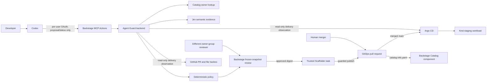

# Backstage Agent Guard: portfolio demo evidence

This is a local platform-engineering demonstration, not a production approval
system. The runnable path has one Kind cluster, one staging environment, and
three platform-owned templates. The Node.js service has a recorded full GitOps
verification; the FastAPI service was also observed running in the local cluster.

## Architecture

Trust boundaries to explain in the blog:

- `declaredIntent` is an agent-supplied statement, not proof of the developer's
  original words. Jev Choice, Noul, and Score are advisory; deterministic policy
  and a distinct reviewer decide whether execution can start.
- Codex sees only Agent Guard proposal/status actions. Direct Scaffolder task
  creation is denied to ordinary users, and the GitOps publisher independently
  checks the approved snapshot and one-time task claim.
- Backstage approval opens a PR; it does not merge or deploy. Argo CD follows
  the merged `main` branch. Read-only observation separately checks PR files,
  merge commit, Argo revision, sync, and workload health.
- One platform-owned Argo CD Application recursively watches `apps/staging/`,
  excluding Backstage descriptors. A merged guarded service folder can deploy
  without creating another Application. A narrow Catalog provider discovers
  descriptors in those folders from the configured GitOps repo's merged `main`
  branch. Confirm each service's delivery evidence independently.

## Evidence already observed

| Claim                                          | Evidence                                                                                                                                                                                | Limit                                                                                                             |
| ---------------------------------------------- | --------------------------------------------------------------------------------------------------------------------------------------------------------------------------------------- | ----------------------------------------------------------------------------------------------------------------- |
| Guarded publishing opened a GitOps PR          | Private PR #1 and matching approved file hashes                                                                                                                                         | The repository is private; use sanitized screenshots for a public blog.                                           |
| Merge deployed the Node.js API                 | Argo CD `Synced`/`Healthy` at `003d35d51920dd44c2b05e5cbaf4c6182edb4447`; ready Pod, available Deployment, internal Service, HTTP `200`                                                 | One service and one staging cluster only.                                                                         |
| Backstage observed delivery without causing it | Agent Guard showed verified delivery; stopping the port-forward changed it to unavailable, not deployed                                                                                 | Observation requires the local GitHub/Argo credentials and connection.                                            |
| Generated Component appears in Catalog         | An isolated live backend run discovered and ingested `apps/staging/gitops-pr-demo-api/catalog-info.yaml` from the private GitOps repo's merged `main` branch. Its Component has owner `payments-team` and Kubernetes ID `gitops-pr-demo-api`. | Dynamic discovery is live-verified for the original service; automatic registration of a second merged service is covered by tests but still needs a live demo. |
| MCP action records authenticated requester     | A local proposal records `user:default/developer`, `mcp_action`, `agent_supplied`, and schema v2 in its frozen envelope and submission audit event. | This proves backend-recorded identity and channel for one local submission, not the developer's original wording. |

## Remaining live evidence to capture

1. Capture the live identity-check proposal in Agent Guard, including
   `Submission: MCP action (backend-recorded)` and the developer requester.
   It remains pending approval; do not approve it merely to prove attribution.
   Do not include browser tokens or Authorization headers in a screenshot.
2. For an approved deployment proposal, sign in as the distinct owner-group
   reviewer and capture the frozen files,
   digest, Jev signals, policy reasons, and review eligibility. For a new
   deployment demo, approval is a separate action.
3. Capture a successful additional service proposal, PR, read-only delivery
   view, and automatically discovered Catalog entity. Verify the entity appears
   only after the PR merges; Catalog registration alone is not deployment proof.
4. Show one semantic mismatch or unavailable-Jev proposal that stays on hold.
   Do not claim that a generic intent is reliably detected; that behavior has
   not been established by an independent evaluation.

## Blog outline

1. Problem: an agent can propose a deployment, but a plausible plan is not
   permission to change a cluster.
2. Boundaries: Backstage Catalog and MCP provide context and the narrow agent
   surface; Jev offers semantic evidence; policy and human review authorize a
   frozen change.
3. Handoff: Scaffolder renders the approved template, opens a GitOps PR, and a
   separate human merge lets Argo CD reconcile it to Kind.
4. Proof: include the approved digest, PR/file-hash evidence, Catalog entity,
   an Argo revision containing the approved merge, workload health, and a
   failed/unavailable case.
5. Limits: agent-supplied intent is unverified, the demo uses local SQLite and
   one cluster/Application, and the live OAuth attribution is evidence for one
   submission rather than an independently audited identity system.

For setup and commands, use the root [README](../README.md) and
[deployment runbook](../deploy/README.md). Never publish `.env`, local Catalog
user mappings, SQLite databases, GitHub tokens, Argo tokens, or deploy keys.
