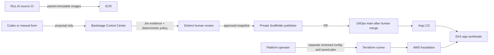

# Rizz.AI IDP handoff (local implementation)

This is the operator handoff for the Rizz.AI extension. It is deliberately
separate from the [Kind demo evidence](portfolio-demo.md). No EKS foundation,
ALB, cloud Argo CD instance, or Terraform state has been created by this work.
Local previews and mocked provider results are **not** cloud delivery evidence.

## Ownership and flow

| Repository                     | Owns                                                                                                                                  | Does not own                                         |
| ------------------------------ | ------------------------------------------------------------------------------------------------------------------------------------- | ---------------------------------------------------- |
| `Rizz.AI` source               | React/nginx frontend, Express/Gemini backend, source tests, paired image CI, application catalog descriptors and app runbooks         | AWS foundation or Agent Guard approvals              |
| `backstage-agent-guard`        | Catalog/Control Center, proposal and review backend, Scaffolder recipes, cloud readers, Terraform configuration and platform runbooks | Application source or live Kubernetes desired state  |
| `backstage-agent-guard-gitops` | Reviewed application manifests on `main`, reconciled by Argo CD                                                                       | Terraform-managed EKS, VPC, registry or state bucket |

Backstage approval authorizes a PR, not a merge, sync, or deployment. The
Rizz.AI source workflow publishes paired images; an application release
proposal selects retained verified evidence and cannot invoke Terraform.
Terraform owns the foundation. Argo CD owns application manifests. The
retirement operation is staged so the ingress/controller-owned ALB can be
observed gone before application declarations are removed; foundation destroy
is a separate infrastructure decision.

## What a second person can inspect locally

1. Start the portal with the named profile in the root [README](../README.md).
   `start:portal` shows Catalog, the three Kind templates, and the Rizz.AI
   Control Center without enabling AWS. Optional release/cloud profiles need
   their ignored local configuration and real read credentials.
2. Open the `rizz-ai` System in Catalog and follow the Control Center link.
   Inspect application ownership, paired release selection, operation forms,
   proposals, exact diffs, Jev evidence, review eligibility, delivery and
   readiness. The original Kind `/agent-guard` flow remains separate.
3. For a local review demonstration, use two mapped GitHub identities. A
   requester submits a typed operation; a distinct authorized reviewer
   considers the frozen intent and changed files. Do not use an agent or
   requester credential to approve its own proposal. Do not approve a cloud
   proposal expecting AWS deployment when the cloud target is absent.
4. Inspect the source repository runbooks for Gemini outage, failed rollout,
   access/secrets and teardown. The metrics endpoint reports in-process
   counters; the UI must show unavailable/unknown if the Kubernetes reader is
   not configured or the workload is not running.

## Evidence ledger and claims

| Capability                     | Local implementation/evidence                                                                                                                                          | Not yet demonstrated                                                                                           |
| ------------------------------ | ---------------------------------------------------------------------------------------------------------------------------------------------------------------------- | -------------------------------------------------------------------------------------------------------------- |
| Kind Agent Guard               | Real private PR #1, human merge, Argo `Synced`/`Healthy`, ready Node.js Pod and HTTP 200; see [Kind evidence](portfolio-demo.md)                                       | Enterprise identity assurance or production HA                                                                 |
| Rizz.AI application operations | Typed deploy, runtime change, rollback and staged retirement contracts, exact snapshot/diff, role-scoped review, guarded PR publisher and read-only observation code   | Live EKS rollout, rollback and ALB cleanup                                                                     |
| Catalog and Control Center     | App-centered local views, roles, release/readiness/metrics integration and runbook links                                                                               | Cloud observations without configured providers and a running workload                                         |
| Terraform foundation           | Terraform roots and bounded staging worker variable; platform-only request/plan-review ledger, reviewed-PR reader, saved-plan binding and unconnected executor library | Remote state, configuration PR publishing, deployed runner/portal Apply/Destroy, AWS plan/apply/drift/teardown |

The Terraform contract rejects a capacity plan containing anything except one
node-group desired-size update, binds an approval to the plan digest and
preconditions, and requires a distinct reviewer. It is not an activated
Terraform control plane. [Infrastructure status](rizz-ai-terraform-control-status.md)
is the source of truth before anybody enables an Apply/Destroy control.

No DevEx time savings, cloud availability, Gemini generation success, AWS
cost, or residual-resource cleanup should be claimed without measurements.
For the planned short cloud run, capture proposal IDs, source commits, paired
image digests, PRs, approval digests, Argo revisions, rollout/smoke evidence,
timestamps, actual spend and post-teardown residual inventory. The US$5/four-
hour checkpoint is a human operating constraint, not a hard cost ceiling.

## Accurate portfolio wording

> Built a Backstage-based platform demo that gates agent-submitted service
> changes with typed validation, Jev semantic evidence, deterministic policy,
> distinct human review and hash-bound GitOps PR publication; demonstrated a
> merged service deployment on Kind with independent Argo/Kubernetes evidence.

For Rizz.AI, describe the Control Center and application lifecycle code as
**locally implemented, awaiting live EKS acceptance**. Do not say it deployed
Rizz.AI on AWS, ran an approved Terraform plan, or automated foundation
teardown until those exact events are independently observed.
